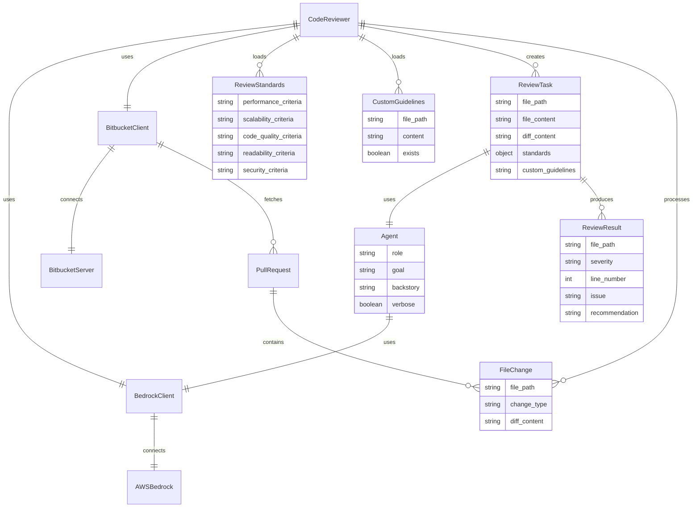
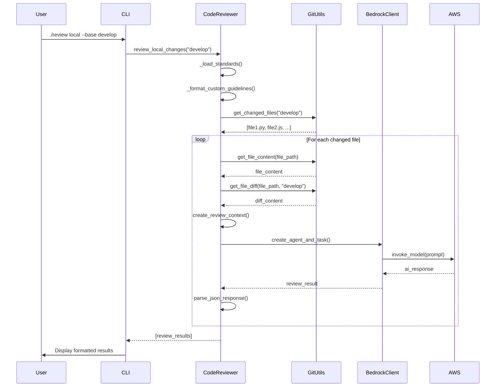
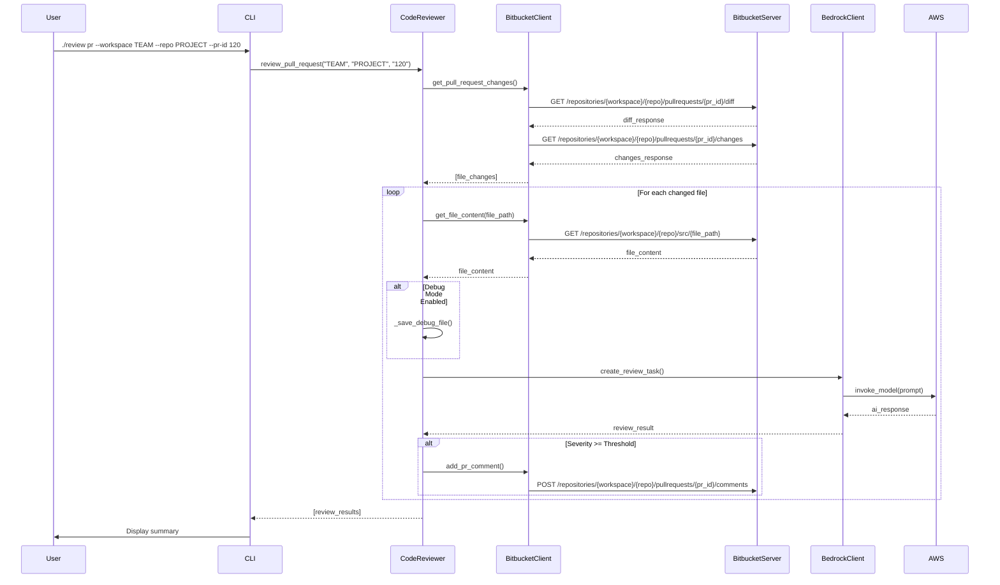

# Architecture Documentation

This document provides a comprehensive overview of the AI Code Review Agent architecture, including system design, data flow, and algorithms.

## System Overview

The AI Code Review Agent is a multi-modal system that performs automated code reviews using AWS Bedrock (Claude 3.5 Sonnet) and integrates with Bitbucket Server for pull request management.

### Core Components

```
┌─────────────────┐    ┌─────────────────┐    ┌─────────────────┐
│   CLI Interface │    │   Web API       │    │   Web UI        │
│   (main.py)     │    │   (FastAPI)     │    │   (Static)      │
└─────────┬───────┘    └─────────┬───────┘    └─────────┬───────┘
          │                      │                      │
          └──────────────────────┼──────────────────────┘
                                 │
                    ┌─────────────▼───────────────┐
                    │     Code Reviewer Core      │
                    │    (code_reviewer.py)       │
                    └─────────────┬───────────────┘
                                  │
        ┌─────────────────────────┼─────────────────────────┐
        │                         │                         │
┌───────▼────────┐    ┌───────────▼──────────┐    ┌─────────▼────────┐
│   Git Utils    │    │   Bitbucket Utils    │    │   Bedrock Client │
│ (Local Files)  │    │  (API Integration)   │    │  (AI Processing) │
└────────────────┘    └──────────────────────┘    └──────────────────┘
```

## Entity Relationship Diagram



## Sequence Diagram

### Local Code Review Flow



### Bitbucket PR Review Flow



## System Architecture

### 1. Presentation Layer

#### CLI Interface (`main.py`, `review`)
- **Purpose**: Command-line interface for developers
- **Features**: Local and PR review modes, argument parsing, environment variable support
- **Design Pattern**: Command pattern with argument delegation

#### Web API (`api_server.py`)
- **Purpose**: REST API for integration with CI/CD systems
- **Framework**: FastAPI with automatic OpenAPI documentation
- **Endpoints**: `/review/local`, `/review/bitbucket`, `/health`

#### Web UI (`static/`)
- **Purpose**: Browser-based interface for non-technical users
- **Technology**: Vanilla HTML/CSS/JavaScript
- **Features**: Form-based review submission, real-time results display

### 2. Business Logic Layer

#### Code Reviewer Core (`code_reviewer.py`)
- **Purpose**: Main orchestrator for review processes
- **Responsibilities**:
  - Load and merge review standards
  - Coordinate file processing
  - Manage AI agent interactions
  - Handle result aggregation and filtering

#### Agent System (`agents/`, `tasks/`)
- **Purpose**: CrewAI-based agent framework
- **Components**:
  - **Senior Reviewer Agent**: General code quality assessment
  - **Security Reviewer Agent**: Security-focused analysis
  - **Review Tasks**: Structured prompts and expected outputs

### 3. Integration Layer

#### Git Utils (`utils/git_utils.py`)
- **Purpose**: Local git repository operations
- **Functions**:
  - `get_changed_files()`: Identify modified files
  - `get_file_content()`: Read current file content
  - `get_file_diff()`: Generate diff against base branch

#### Bitbucket Utils (`utils/bitbucket_utils.py`)
- **Purpose**: Bitbucket Server API integration
- **Functions**:
  - `get_pull_request_changes()`: Fetch PR file changes
  - `get_file_content()`: Download file from repository
  - `add_pr_comment()`: Post review comments

#### Bedrock Client (`utils/bedrock_client.py`)
- **Purpose**: AWS Bedrock AI service integration
- **Features**:
  - Model invocation with retry logic
  - Response parsing and validation
  - Error handling and fallbacks

### 4. Configuration Layer

#### Review Standards (`config/review_standards.yaml`)
- **Purpose**: Define base code review criteria
- **Categories**: Performance, Scalability, Code Quality, Readability, Security

#### Custom Guidelines (`.amazonq/rules/coding-standards.md`)
- **Purpose**: Project-specific coding standards
- **Features**: Automatic detection, Markdown format, version control friendly

## Algorithm Details

### 1. File Processing Algorithm

```python
def process_files(changed_files):
    reviews = []
    for file_path in changed_files:
        if should_review_file(file_path):
            # 1. Content Extraction
            file_content = get_file_content(file_path)
            diff_content = get_file_diff(file_path)
            
            # 2. Context Building
            context = build_review_context(
                file_path, file_content, diff_content,
                standards, custom_guidelines
            )
            
            # 3. AI Processing
            review_result = invoke_ai_review(context)
            
            # 4. Result Processing
            parsed_result = parse_and_validate(review_result)
            reviews.append(parsed_result)
    
    return reviews
```

### 2. Standards Merging Algorithm

```python
def load_standards(config_path):
    # 1. Load base standards
    base_standards = load_yaml(config_path)
    
    # 2. Check for custom guidelines
    custom_path = '.amazonq/rules/coding-standards.md'
    if file_exists(custom_path):
        custom_content = read_file(custom_path)
        base_standards['custom_guidelines'] = custom_content
    
    return base_standards
```

### 3. Severity Filtering Algorithm

```python
def filter_by_severity(reviews, min_severity):
    severity_order = ['suggestion', 'minor', 'major', 'critical']
    min_index = severity_order.index(min_severity)
    
    filtered_reviews = []
    for review in reviews:
        for feedback in review.get('feedback', []):
            severity_index = severity_order.index(feedback['severity'])
            if severity_index >= min_index:
                filtered_reviews.append(feedback)
    
    return filtered_reviews
```

## Data Flow Architecture

### 1. Input Processing Flow

```
User Input → Environment Variables → CLI Arguments → API Parameters
     ↓
Configuration Loading → Standards Merging → Custom Guidelines
     ↓
File Discovery → Content Extraction → Diff Generation
     ↓
Context Building → AI Prompt Generation
```

### 2. AI Processing Flow

```
Structured Prompt → AWS Bedrock → Claude 3.5 Sonnet
     ↓
JSON Response → Validation → Error Handling
     ↓
Result Parsing → Severity Assessment → Line Number Validation
```

### 3. Output Processing Flow

```
Review Results → Severity Filtering → Comment Generation
     ↓
Local Display ← → Bitbucket Comments ← → API Response
     ↓
Debug File Storage (if enabled)
```

## Performance Considerations

### 1. Optimization Strategies

- **Parallel Processing**: Multiple files can be processed concurrently
- **Caching**: Bedrock responses cached for similar code patterns
- **Filtering**: Early filtering of non-reviewable files
- **Batching**: Group similar files for batch processing

### 2. Scalability Factors

- **Rate Limiting**: AWS Bedrock API limits
- **Memory Usage**: Large file content processing
- **Network Latency**: Bitbucket API response times
- **Concurrent Users**: Multiple review sessions

### 3. Error Handling

- **Retry Logic**: Exponential backoff for API failures
- **Graceful Degradation**: Continue processing other files on single file failure
- **Validation**: JSON response validation with fallback parsing
- **Logging**: Comprehensive error logging for debugging

## Security Architecture

### 1. Authentication Flow

```
User Credentials → Environment Variables → API Tokens
     ↓
Bitbucket Server Authentication → AWS IAM Authentication
     ↓
Secure API Communication (HTTPS/TLS)
```

### 2. Data Protection

- **Secrets Management**: Environment variables for sensitive data
- **Code Privacy**: No code content stored permanently
- **Debug Mode**: Optional file storage with clear warnings
- **Access Control**: Token-based authentication for all APIs

### 3. Compliance Considerations

- **Data Residency**: AWS region configuration
- **Audit Logging**: All API calls logged
- **Retention Policy**: No permanent code storage
- **Privacy**: Code content processed in memory only

## Deployment Architecture

### 1. Development Environment

```
Local Machine → Git Repository → Environment Variables
     ↓
Python Virtual Environment → Dependencies Installation
     ↓
CLI Usage → Local File Processing
```

### 2. Production Environment

```
Docker Container → Environment Configuration → Service Discovery
     ↓
Load Balancer → FastAPI Application → Background Workers
     ↓
External Integrations (Bitbucket, AWS)
```

### 3. CI/CD Integration

```
Git Hook → CI Pipeline → Code Review Agent
     ↓
Review Results → PR Comments → Merge Decision
```

## Monitoring and Observability

### 1. Metrics Collection

- **Review Processing Time**: Time per file and total review time
- **API Response Times**: Bitbucket and AWS Bedrock latency
- **Error Rates**: Failed reviews and API errors
- **Usage Patterns**: Most reviewed file types and common issues

### 2. Logging Strategy

- **Structured Logging**: JSON format for easy parsing
- **Log Levels**: DEBUG, INFO, WARNING, ERROR, CRITICAL
- **Context Preservation**: Request IDs and user context
- **Performance Logging**: Processing times and resource usage

### 3. Health Monitoring

- **Health Endpoints**: `/health` for service status
- **Dependency Checks**: Bitbucket and AWS connectivity
- **Resource Monitoring**: Memory and CPU usage
- **Alert Configuration**: Critical error notifications

## Future Architecture Considerations

### 1. Scalability Enhancements

- **Microservices**: Split into specialized services
- **Message Queues**: Asynchronous processing with Redis/RabbitMQ
- **Database Integration**: Persistent storage for review history
- **Caching Layer**: Redis for response caching

### 2. Feature Extensions

- **Multi-Model Support**: Different AI models for different languages
- **Plugin Architecture**: Custom review rules and processors
- **Webhook Integration**: Real-time PR event processing
- **Analytics Dashboard**: Review metrics and trends

### 3. Integration Improvements

- **Multiple VCS Support**: GitHub, GitLab integration
- **IDE Plugins**: VS Code, IntelliJ extensions
- **Slack/Teams Integration**: Review notifications
- **JIRA Integration**: Issue tracking integration
