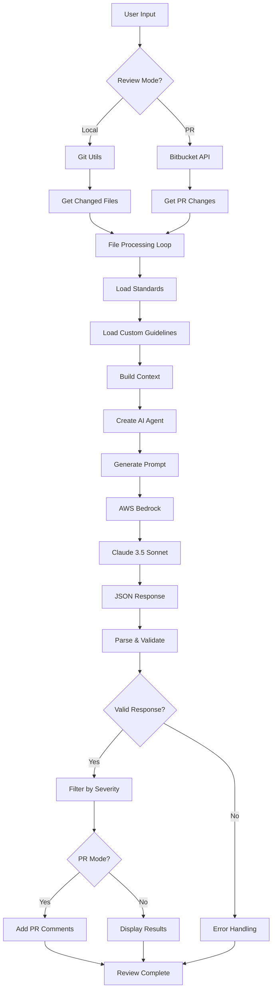
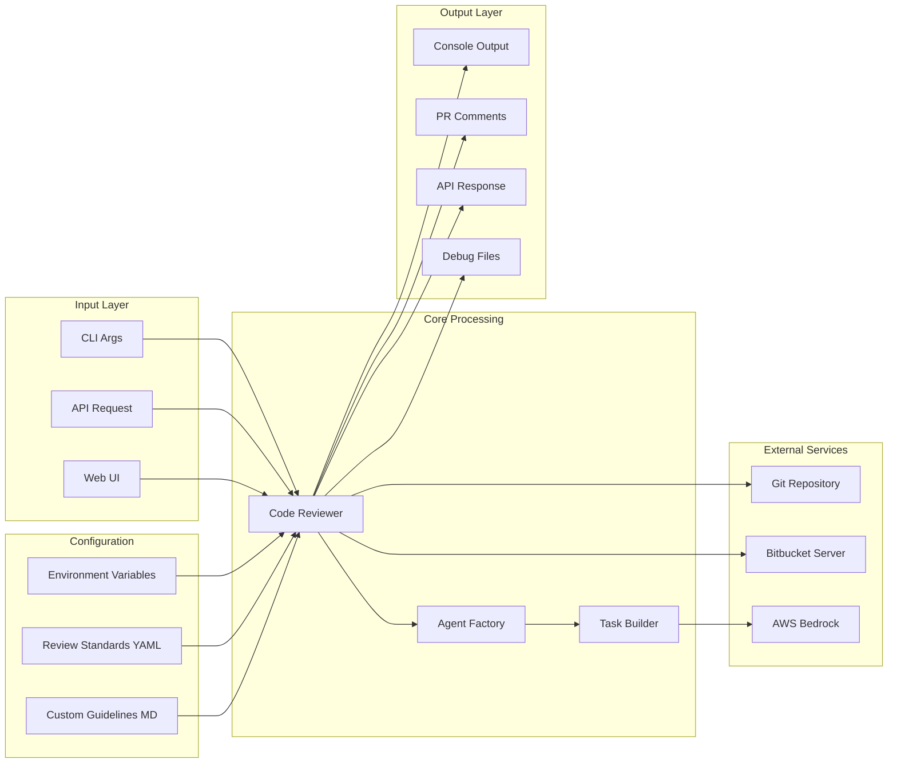
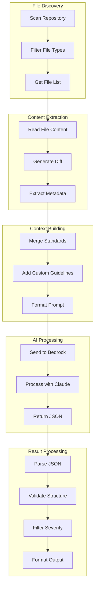
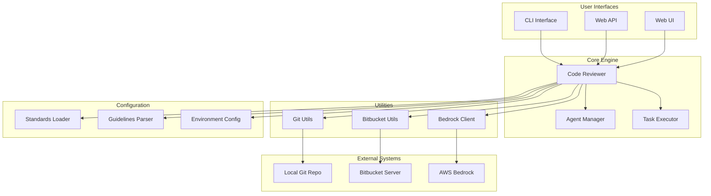
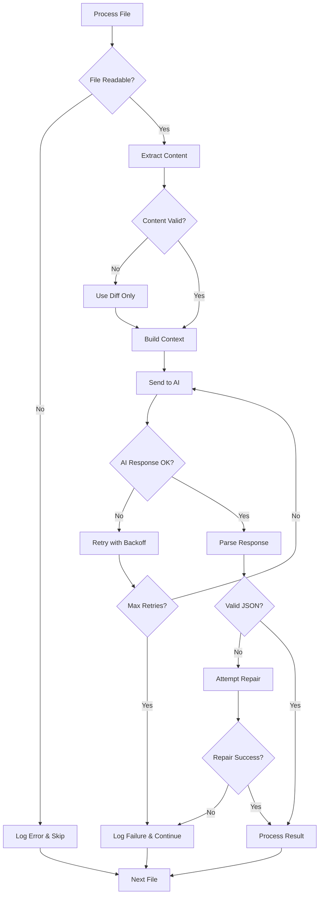
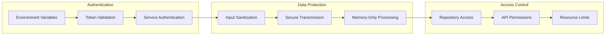
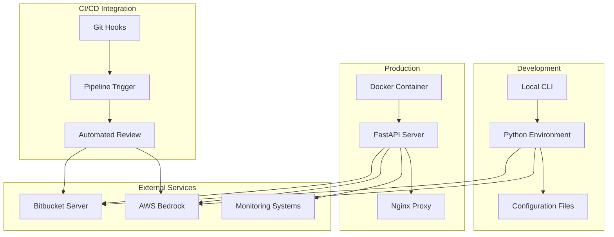
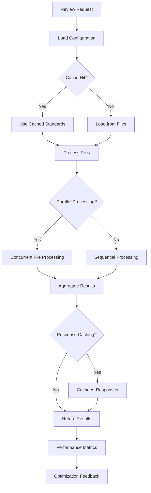
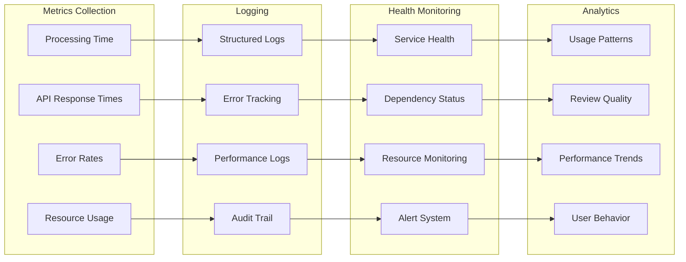

# System Diagrams

This document contains visual diagrams for the AI Code Review Agent system.

## High-Level System Flow

## Detailed Processing Flow

## Data Processing Pipeline

## Component Interaction Diagram

## Error Handling Flow

## Security Flow

## Deployment Architecture

## Performance Optimization Flow

## Monitoring and Observability

